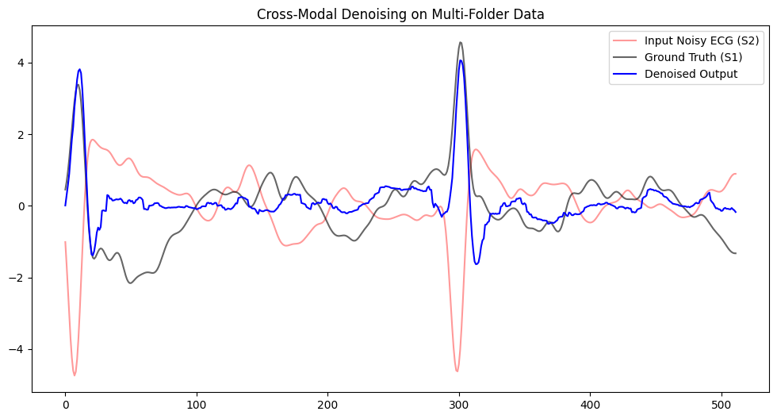
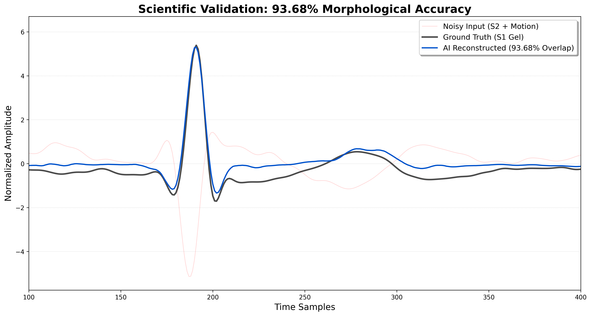

# ECG Denoising Using Deep Autoencoder

## Overview

This project focuses on denoising ECG signals affected by motion artifacts and noise using deep learning and signal processing techniques.

The project was developed as part of a codeathon and includes the experimentation and development process along with the final implementation.

The ECG data is obtained from EDF files and processed using MNE. A clean ECG signal from a gel electrode is used as the ground truth, while a dry electrode ECG signal and chest acceleration data are used as inputs for denoising.

## Methodology

The ECG denoising pipeline consists of:

1. Loading ECG and accelerometer signals from EDF files.
2. Extracting the clean ECG, noisy ECG and accelerometer signals.
3. Calculating accelerometer magnitude as a motion reference.
4. Applying a Butterworth band-pass filter from 0.5–40 Hz.
5. Standardizing the input and target signals.
6. Dividing the signals into windows of 512 samples.
7. Training a 1D U-Net based deep learning model.
8. Using a custom loss function combining Mean Squared Error and temporal correlation loss.
9. Reconstructing the clean ECG signal.
10. Evaluating the output using Pearson correlation and SNR improvement.

## Model

The final model uses a 1D U-Net architecture consisting of:

- Conv1D layers
- MaxPooling1D
- Bottleneck convolution layer
- UpSampling1D
- Skip connections
- Final Conv1D output layer

The model takes the noisy ECG and accelerometer magnitude as inputs and reconstructs the clean ECG signal.

## Results

The reconstructed ECG is compared with the clean ground-truth ECG using:

- Pearson Correlation
- Initial SNR
- Denoised SNR
- SNR Improvement

The notebook also provides visual comparison between the noisy ECG, accelerometer reference, ground-truth ECG and reconstructed ECG.

### ECG Denoising

### Reconstruction Accuracy

## Files

- `respireai.ipynb` – Initial experimentation and development of the ECG denoising approach.
- `final.ipynb` – Final implementation using a cross-modal 1D U-Net model.
- `main.py` – Python implementation of the final ECG denoising pipeline.
- `requirements.txt` – Required Python libraries.

## Technologies Used

- Python
- TensorFlow / Keras
- MNE
- NumPy
- SciPy
- Scikit-learn
- Matplotlib

## Dataset

The project uses ECG data stored in EDF format from the ScientISST chest dataset.

The dataset is not included in this repository. The EDF file should be placed locally before running the code.

## Future Scope

- Testing with larger ECG datasets
- Improving model performance
- Exploring CNN and other deep learning architectures
- Real-time ECG denoising for wearable devices
